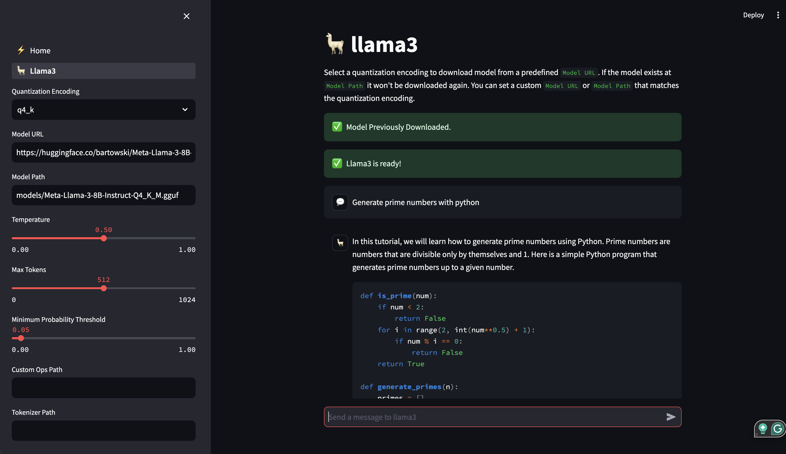

# MAX Examples GUI

Example project showing how to create a GUI that calls MAX using the Python
[streamlit](https://streamlit.io/) library.

## Quick Start

Install MAX if you haven't already:
[modul.ar/install-max](https://modul.ar/install-max)

Pixi is the fastest way to create a reproducible Python environment:

```bash
curl -fsSL https://pixi.sh/install.sh | bash
```

Restart your shell then run:

```bash
pixi run setup
```

This is a one time setup to find where the MAX wheels are located and add them
to the `pyproject.toml`.

Now when you want to run the GUI:

```bash
pixi run gui
```

If you've installed both the nightly and stable MAX SDKs, stable will be the
default environment. To run nightly do:

```bash
git checkout nightly # make sure you're on the nightly branch
pixi run -e nightly gui
```

## Working Examples

### Llama3 Interactive Chatbot


